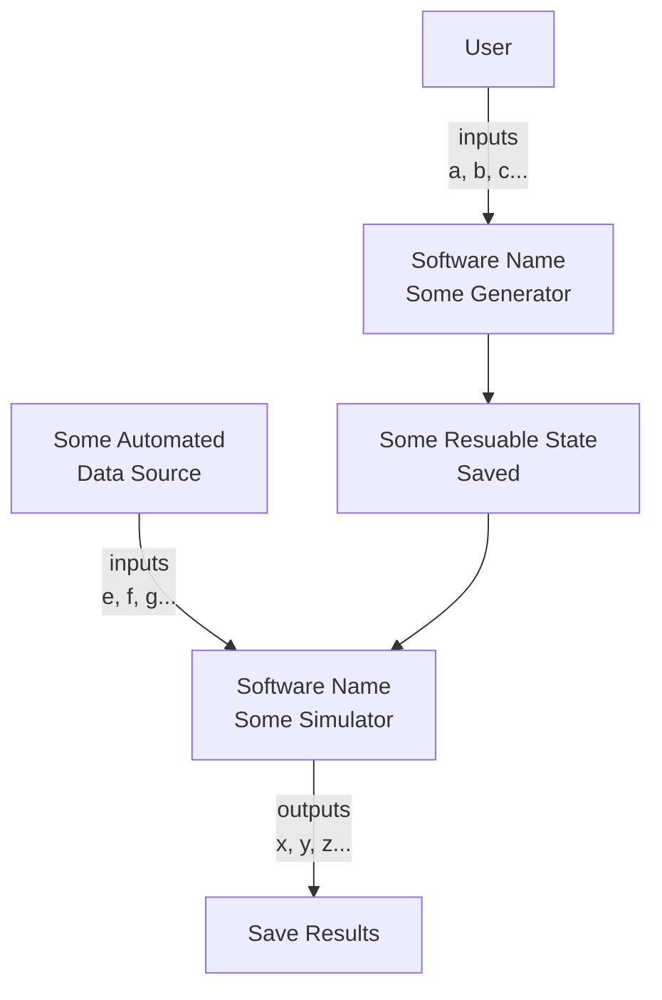
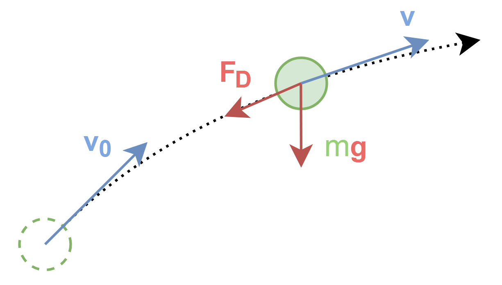

# System Description

## System Context
> Give a brief description of how the software should work on a system level.
> For better illustration, you should include a block diagram or a flowchart.  
> You can use [Mermaid](https://squidfunk.github.io/mkdocs-material/reference/diagrams/) (as shown below) or any other tool (PowerPoint, [draw.io](https://draw.io), etc.) to create the diagram.
> If the software takes multiple steps to run, they should be represented in the diagram, like the example below.

## Physical System
> Draw a diagram to illustrate the physical system that the software is trying to model.

## Inputs
> Listed here are values that should be provided for the software to run.  

> As a principle, you should provide as many inputs as possible for values in the software, instead of hard-coding them. This allows the user to tweak the software to their needs without changing the code. This will save both the developer's and the domain expert's time during the research process, when the software is used in a more "exploratory" manner.     
> Default values should be provided where possible, especially for these "tweaking parameters", as future users may just want to run the software using the default setting without much hassle.  

> Default values are also important in case the user cannot provide certain inputs. They should represent a typical use case. You should document how you come up with these default values as they may affect the results.  
> It is possible that you cannot really provide a typical use case for some of the inputs yet. In which case, use an educated guess and note it here. You can come back when you have a working prototype or when the research progresses.

| Name | Symbol | Unit | Default Value | Acceptable Range or Typical Value | Notes |
| --- | --- | --- | --- | --- | --- |
| Initial Speed | $v_0$ | $\text{m/s}$ | $10$ | $0<v_0$ | |
| Initial Angle | $\theta$ | $\text{rad}$ | $\frac{\pi}{4}$ | $0 \leq \theta < \frac{\pi}{2}$ | |
| Drag Coefficient | $C_d$ | - | [see below](#drag-coefficient) | $0.8$ | Interpolated from table |
| Gravity | $g$ | $\text{m/s}^2$ | $9.81$ | $0 \leq g$ | |
| Air Density | $\rho$ | $\text{kg/m}^3$ | $1.225$ | $0 \leq \rho$ | |
| Cross Wind | $v_{\text{wind}}$ | $\text{m/s}$ | $0$ | $-\infty < v_{\text{wind}} < \infty$ | Perpendicular component to flight path |
| Time Step | $\Delta t$ | $\text{s}$ | $0.01$ | $0 < \Delta t$ | Will affect accuracy and computation time |
| Some Input | $x$ | $\text{unit}$ | $0$ | $0 \leq x \leq 1$ | |
| ... | ... | ... | ... | ... | ... |

### Data Sources
> Some non-trivial default values may come from external sources, your own experiments or some other reasoning. You should document them here.  
> This is especially important for some tabulated values, coefficients, etc. that are not easily obtained.

#### Drag Coefficient
The default $C_d$ vs Much Number ($M$) curved is for object X, obtained from SOME SOURCE [@CITATION].

## Outputs
> Listed here are values that the software should provide after running.

| Name | Symbol | Unit | Note |
| --- | --- | --- | --- |
| Maximum Height | $h_{\text{max}}$ | $\text{m}$ |  |
| Height | $h$ | $\text{m}$ | An array of values with respect to time |
| Windage | $w$ | $\text{m}$ | An array of values with respect to time |
| Range | $r$ | $\text{m}$ | An array of values with respect to time |
| Time | $t$ | $\text{s}$ | Timestamps for the above arrays |
| ... | ... | ... | ... |