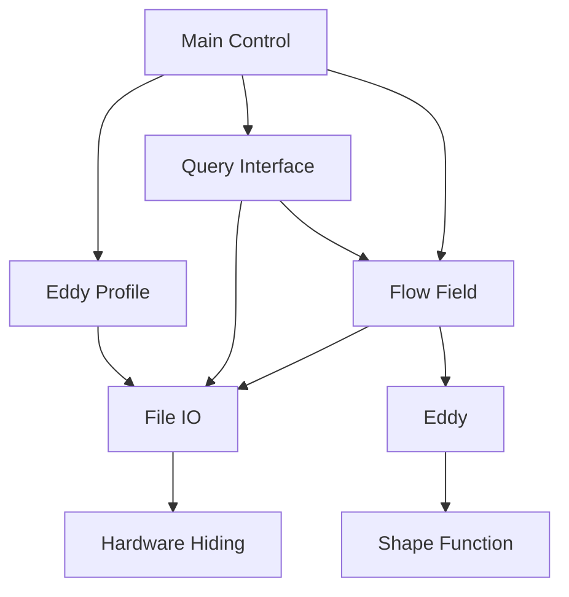

# Software Design

## Design Decisions
> Here is where you talk about some overall design decisions that are not specific to a single module.

### Connection to Requirements
>  The SRS already documents what calculations need to happen, but how will you design the software to make those calculations happen?

### Connection to Test Cases
> This section may only be relevant for some projects.  
> Sometimes, what can be tested with a good test case can influence design decisions.   
> For example, the theoretical model you want to use may be hard to test, but there is a simpler model that is possible to test. In this case, you may want to design them as modules with a common interface so that you can switch between them easily, and as little in information in the untestable model as possible.

## Software Interface
### User Interface
> How will the user interact with the software?  
> Graphical User Interface (GUI), Command Line Interface (CLI), Physical Controls, etc.

### Communication Protocols
> If the software needs to communicate with other software, what protocols will it use?

## Modules
> Draw a use-hierarchy diagram to show how the modules are related to each other.   
> You can use [Mermaid](https://squidfunk.github.io/mkdocs-material/reference/diagrams/) (as shown below) or any other tool (PowerPoint, [draw.io](https://draw.io), etc.) to create the diagram.

> Here is an example of a use-hierarchy diagram using Mermaid from [SynthEddy](https://github.com/omltcat/turbulent-flow)

- [**Software Design**](README.md)
- [M1: Some Module Name](M1.md)
- [M2: Another Module Name](M2.md)
- [...](...)